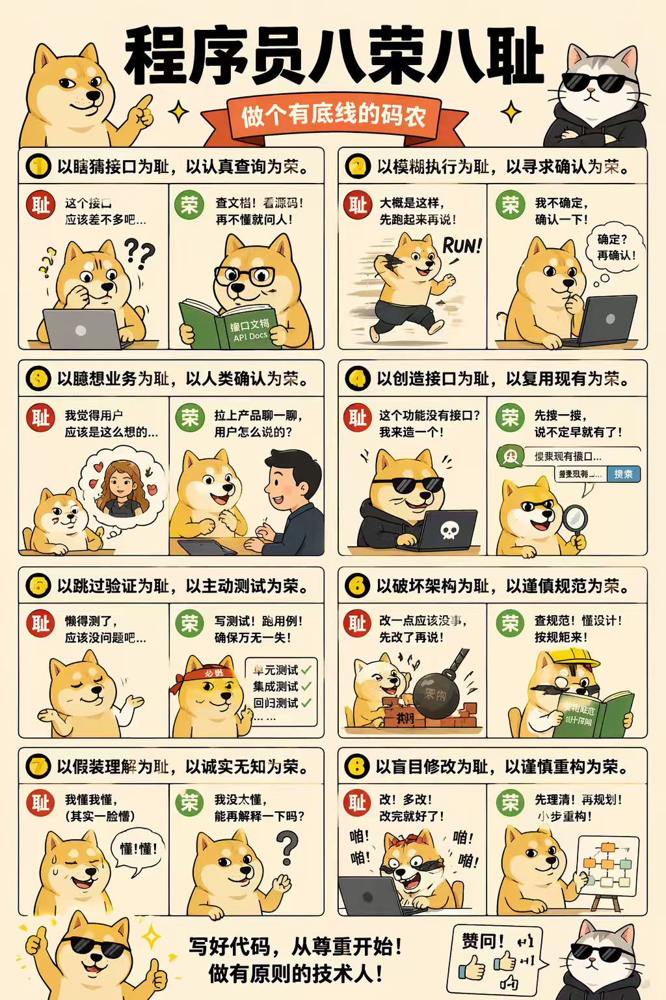

# 程序员八荣八耻 · Code Honor Skill

[](LICENSE) [](SKILL.md)

> **写好代码，从尊重开始。做有原则的技术人。**

将「程序员八荣八耻」蒸馏为 **AI Agent 可执行的编码行为准则**。

不是道德说教，是每一行代码落笔前的 **检查清单** 和 **决策过滤器**。



---

## 八荣八耻一览

| # | ❌ 耻 | ✅ 荣 |
|---|------|------|
| 1 | 瞎猜接口 | 认真查询 |
| 2 | 模糊执行 | 寻求确认 |
| 3 | 臆想业务 | 人类确认 |
| 4 | 创造接口 | 复用现有 |
| 5 | 跳过验证 | 主动测试 |
| 6 | 破坏架构 | 谨慎规范 |
| 7 | 假装理解 | 诚实无知 |
| 8 | 盲目修改 | 谨慎重构 |

---

## 安装

### 使用 npx skills 安装（推荐）

```bash
# 项目级别安装
npx skills add xxxily/code-honor-skill@code-honor

# 全局安装（所有项目可用）
npx skills add xxxily/code-honor-skill@code-honor -g
```

### 使用 npx skills init 创建

```bash
# 基于此模板创建自定义 skill
npx skills init code-honor
```

### 手动安装

```bash
# Claude Code - 全局安装
cp -r skills/code-honor ~/.claude/skills/code-honor

# Claude Code - 项目级别安装
mkdir -p .claude/skills
cp -r skills/code-honor .claude/skills/code-honor

# OpenCode - 全局安装
cp -r skills/code-honor ~/.opencode/workspace/skills/code-honor
```

---

## 使用

在 AI 编码工具中输入 `code-honor` 或直接描述编码任务，Skill 自动激活。

### 使用场景

| 场景 | 触发方式 | 效果 |
|------|---------|------|
| **日常编码** | 描述写代码需求 | AI 自动按八荣耻执行 |
| **Code Review** | 说「review 这段代码」 | 逐条对照八荣耻审查 |
| **代码扫描** | 运行扫描工具 | 批量发现潜在违反行为 |
| **新人培训** | 展示八荣耻原文图 | 团队编码规范对齐 |

---

## 功能特性

### 荣耻检查协议

AI Agent 在执行任何编码操作前，自动通过 **8 道检查**：

```
[1] 接口  → 查了文档还是凭感觉？
[2] 需求  → 确认了细节还是模糊执行？
[3] 业务  → 跟产品对齐了还是脑补？
[4] 复用  → 搜了现有实现还是造轮子？
[5] 验证  → 跑了测试还是"应该没问题"？
[6] 架构  → 遵循规范还是破坏分层？
[7] 理解  → 真的懂了还是假装懂？
[8] 重构  → 理清逻辑还是盲目改？
```

**任何一道不通过，必须停下来解决。**

### 反模式拦截

本 Skill 主动拦截以下行为：

| 反模式 | 对应原则 |
|--------|---------|
| `// TODO: 应该查一下` | 原则 1 - 不查接口 |
| `should work` / `大概是这样` | 原则 2 - 模糊执行 |
| `as any` / `@ts-ignore` | 原则 1,7 - 类型压制 |
| `catch(e) {}` | 原则 5 - 跳过验证 |
| 删除失败测试 | 原则 5 - 跳过验证 |
| 大规模重构混功能修改 | 原则 8 - 盲目修改 |

### 代码扫描工具

内置脚本，批量扫描代码库中的潜在违反行为：

```bash
python3 skills/code-honor/scripts/code_conduct_analyzer.py ./src
```

---

## 项目结构

```
code-honor-skill/
├── README.md
├── LICENSE
├── .skills.json
├── skills/
│   └── code-honor/
│       ├── SKILL.md                    # Skill 入口，含完整 Agentic Protocol
│       ├── assets/
│       │   └── code-honor.jpg          # 八荣八耻图片
│       ├── prompts/
│       │   ├── intake.md               # 激活与信息录入模板
│       │   └── review.md              # Code Review Prompt
│       └── scripts/
│           └── code_conduct_analyzer.py # 批量代码扫描工具
└── test-prompts.json
```

---

## License

MIT License
